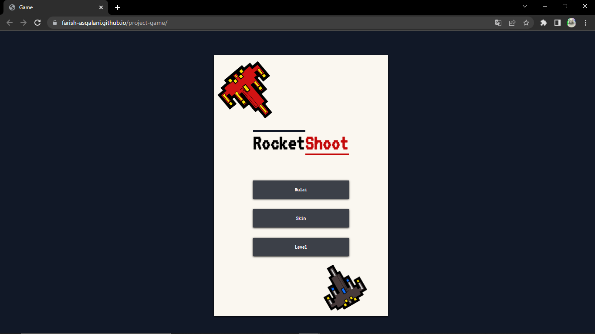

## RocketShoot

> How to play

1. You can visit this url https://farish-asqalani.github.io/project-game/. To go to the website
2. After you open the website you will see the main menu and a start button and setting button.
3. If you want to play this game you have to click the "start" button. And then you can chose level from level one to three. After you chose the level, you have to pick your character that you can pick.
4. When the game started the character will be faced with obstacle you must avoided
5. In order to play this game you can use spacebar on the keyboard to make the character fly.
6. If the character hits the obstacle, then game over
7. But if you manage to avoid all obstacle and reaches the score target, then you will win

> Languages that i use
>  
>   
